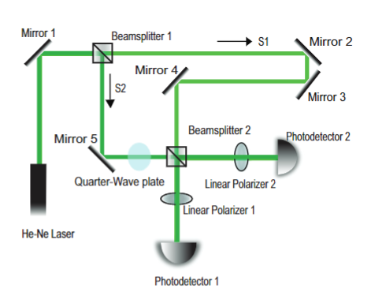

# Low Cost Quad Interferometer
This research experiment recreates a quadrature Mach-Zenhder optical inferometer using Adafruit microcontroller for analog-to-digital data acquisiton. 


// insert picture of the working setup



# Motivation
We report on the construction and characterization of a low-cost Mach-Zehnder optical interferometer in which quadrature signal detection is achieved by means of polarization control. The device incorporates a store-bought laser pointer, home-built photodetectors, 3D-printed optical mounts, a circular polarizer extracted from a pair of 3D movie glasses, and a Python-enabled microcontroller for analog-to-digital data acquisition. Components fit inside of a 12"x6" space and can be assembled on a budget of less than \$500. The device has the potential to make quadrature interferometry accessible and affordable for labs, students, and enthusiasts alike.

# Quick Start
Use the package manager pip to install all required libraries
```bash
pip install notebook
pip install numpy
pip install matplotlib
pip install pandas
pip install serial
```
1. Open Create_CSV.py file and check that USB port matches port that trinket is plugged into
on computer. You can check this by using the terminal to check devices plugged into the USB
ports, or you can use the Mu editor for coding the trinket. In Mu hover over the connection
symbol in the bottom right of the window and it will tell the USB port the trinket is connected to.
2. Run Create_CSV.py first, if indexing error occurs on boot then run again until successful
3. Chose Animate_expansion.py, Animate_raw_signal.py, or Animate_lisafig.py and run to see
realtime data
4. When done, quit Create_CSV.py and check to see that data.csv has been generated and
updated
5. Run coefficient_of_thermal_expansion.py to generate graph
# Usage
We utilized Mu Editor and edit our code in circuit-python.

# Screenshots
#Insert code snippets

# List of Components
Quantity | Item Description | Brand/Supplier | Cost 
-------- | ---------------- | -------------- | ------
1 | Green Laser Pointer | DinoFire | $23.99
1 | Aluminum Plate | Kaylan | $19.99
1 | Pair of 3D glasses | Real D 3D | $4.99
1 | Plastic Sheet Polarizer | Ixgut | $12.99
1 | Spool 3D printer filament | Geeetech | $19.53
2 | Nonpolarizing Beamsplitter | Edmund Optics | $90.00
5 | Silvered Mirrors | Thorlabs | $164.20
2 | Plano-Convex lens | Pre-owned | $9.00
2 | Kinematic mount | Thorlabs | $79.72
2 | Home-built Photodetectors | Various | $10.00
1 | LM35 Temperature Sensor | TI | $2.29
1 | Trinket M0 MicroController | Adafruit | $8.39
1 | Hot Glue Gun | Art Minds | $13.99
1 | Package Hot Glue | Art Minds | $5.49
1 | Package 5 minute epoxy | Loctite | $3.69
Total | | |$468.26


# 3D Print Files
These were the STL files for our mounts for the adafruit m0 trinket and the photodiode. 

# Contributing
Pull requests are welcome. For major changes, please open an issue first to discuss what you would like to change.

Please make sure to update tests as appropriate.
# License
